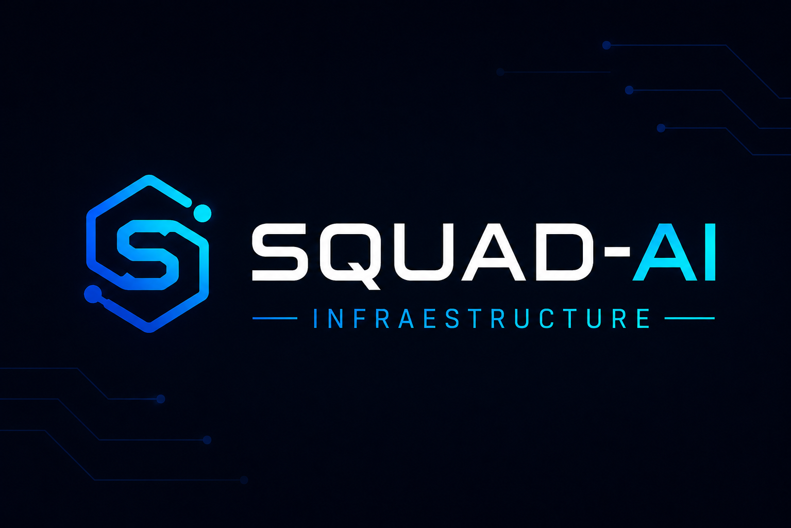

<!-- markdownlint-disable MD041 -->

# Squad-AI | Infraestrutura



| 🏷️ Versão | 📅 Data | 📝 Licença | 👤 Autor |
|----------|---------|------------|----------|
| 1.0.0 Minimal | 17/05/2026 | MIT | wagner85 |

> *"O próximo nível da operação de infraestrutura não será manual."*
> *"Será coordenado por squads de agentes AI especializados."*


---

## 📋 Visão do Projeto

A infraestrutura moderna está ficando complexa demais para operações tradicionais.

| Problema | Impacto |
|----------|---------|
| 🔴 Incidentes crescentes | Times sobrecarregados |
| 🔴 Múltiplas ferramentas | Fragmentação operacional |
| 🔴 Documentação inconsistente | Conhecimento perdido |
| 🔴 carga operacional | Baixa produtividade |

### 🎯 O que somos

O **Squad-AI | Infraestrutura** é um:

- 🖥️ Sistema operacional de automação
- 🤖 Coordenador de múltiplos agentes AI
- 📊 Pipeline operacional de 6 estágios
- 🔄 Motor de transformação DevOps → SRE → Platform Engineering

---

## 🌐 Open Source Edition

| Recurso | 🔵 Minimal | 🟢 Enterprise (Esta) |
|---------|:----------:|:--------------------:|
| Pipeline de 6 estágios | ✅ | ✅ |
| 18 Agentes especializados | ✅ | ✅ |
| Condições de veto | ✅ | ✅ |
| Memória aprendente | ✅ | ✅ |
| Dashboard em tempo real | ❌ | ✅ |
| Interface visual completa | ❌ | ✅ |
| Multi-workspaces | ❌ | ✅ |
| Integrações corporativas | ❌ | ✅ |

> 💡 **Nota**: Esta versão agora inclui suporte completo ao **Dashboard local em tempo real** (porta 4200), **Multi-workspaces** e **Integrações corporativas**. Para inicializar o painel, execute o comando `/squad-ai dashboard`.

---

## 🚀 Por que este projeto existe?

### 😰 Desafios dos Times de Infraestrutura

| # | Desafio | 🔥 Severidade |
|---|---------|:-------------:|
| 1 | Incidentes recorrentes | Alta |
| 2 | Alert fatigue | Alta |
| 3 | Ferramentas desconectadas | Média |
| 4 | Pressão por disponibilidade | Alta |
| 5 | Operações repetitivas | Média |
| 6 | Documentação desatualizada | Baixa |
| 7 | Dependência humana | Alta |

### 💡 A Proposta

| Atual | ➡️ | Futuro |
|-------|-----|--------|
| 🤖 Chatbots isolados | ➡️ | 🤖🤖🤖 Squads coordenados |
| 📝 Automação simples | ➡️ | 🧠 IA operacional |
| 👤 Trabalho manual | ➡️ | ⚡ Execução autônoma |

---

## ⭐ Principais Recursos

### 🔄 Pipeline de 6 Estágios

```
📥 Análise → 📐 Planejamento → ⚙️ Execução → 🔒 Segurança → 📚 Documentação → ✅ Revisão
   (SRE)        (Architect)        (DevOps)      (Security)        (Docs)         (Tech Lead)
```

| Recurso | Descrição |
|---------|-----------|
| 🧠 Agentes especializados | Cada etapa com IA dedicada |
| ✅ Validações automáticas | Critérios de veto integrados |
| 🛑 Checkpoints | Aprovação manual entre etapas |
| 📊 Outputs estruturados | Artefatos formatados |
| 🔒 Qualidade | Bloqueio automático de inconsistências |

---

### 👥 18 Agentes Especializados

| # | 🤖 Agente | 💼 Função | 🛠️ Especialidade |
|---|-----------|-----------|------------------|
| 1 | 🔄 DevOps Engineer | CI/CD & IaC | Terraform, Ansible, GitHub Actions |
| 2 | 📈 SRE Engineer | Observabilidade | Prometheus, Grafana, SLOs |
| 3 | 🌐 Network Engineer | Redes | Firewall, VPN, DNS |
| 4 | 🔐 Cyber Security | Segurança | IAM, Compliance, Pentest |
| 5 | 🏛️ Tech Lead | Revisão técnica | Code Review, Architecture |
| 6 | 📐 Solution Architect | Arquitetura | Design de sistemas |
| 7 | 📊 Project Manager | Gestão | Prazos, Recursos |
| 8 | 🎯 Product Owner | Produto | backlog, Priorização |
| 9 | 💻 Fullstack Dev | Desenvolvimento | Node, Python, Go |
| 10 | 🗄️ Data Engineer | Dados | ETL, Pipelines, Analytics |
| 11 | 🤖 AI Automation | Automação | LLMs, RPA, AIOps |
| 12 | 📝 Docs Specialist | Documentação | Runbooks, ADRs, Wiki |
| 13 | 🎧 L1 Support | Suporte | Triagem, Monitoramento |
| 14 | 📈 Report Master | Relatórios | Dashboards, KPIs |
| 15 | 📋 Jira Reporter | Integração | Service Desk,Projetos |
| 16 | 💼 Business Exec | Negócio | Stakeholders, ROI |
| 17 | 🔀 Git Analyst | Repositórios | ArgoCD, GitOps |
| 18 | 🧠 Obsidian Brain | Conhecimento | Vault, Memory |

---

### 🛡️ Condições de Veto Automático

| Etapa | ✅ Validado | ❌ Bloqueado |
|-------|------------|--------------|
| **Analysis** | Métricas concretas + evidências + recomendações acionáveis | Sem dados mensuráveis |
| **Planning** | Riscos + estimativas + arquitetura documentada | Sem planejamento de rollback |
| **Execution** | Validação pós-execução + rastreabilidade | Execução sem testes |
| **Security** | Compliance + IAM + vulnerabilidades documentadas | Falta de revisão segurança |
| **Documentation** | Runbooks + pré-requisitos + validação | Documentação incompleta |
| **Review** | Consistência entre outputs + qualidade técnica | Inconsistências detectadas |

---

### 🧠 Aprendizado Contínuo

| Tipo | 📦 Armazenamento |
|------|-----------------|
| 👤 Preferências do usuário | `_squad-ai/_memory/preferences.md` |
| 🏢 Contexto operacional | `_squad-ai/_memory/company.md` |
| 📈 Histórico de padrões | `squads/infra/_memory/memories.md` |
| 📚 Memória organizacional | Obsidian Vault |

---

### 🌐 Multi-Plataforma

| 🖥️ SO | 🟢 Status | 📝 Instalação |
|-------|:--------:|---------------|
| Windows | ✅ Testado | `winget install OpenCode` |
| Linux | ✅ Testado | `curl -fsSL https://opencode.ai/install.sh \| sh` |
| macOS | ✅ Testado | `brew install opencode` |

---

### 🧩 Multi-IDE Compatibility

O **Squad-AI** funciona em qualquer IDE com suporte a agentes AI — basta abrir o projeto.

| 🖥️ IDE | 🔑 Config | 🟢 Status |
|--------|-----------|:---------:|
| **OpenCode** | `opencode.json` + `AGENTS.md` | ✅ Nativo |
| **Claude Code** | `CLAUDE.md` → `AGENTS.md` | ✅ Suportado |
| **Gemini CLI / Antigravity** | `GEMINI.md` → `AGENTS.md` | ✅ Suportado |
| **Cursor** | `.cursor/rules/squad-ai.mdc` | ✅ Suportado |
| **Windsurf / Zed / Aider** | `AGENTS.md` (padrão universal) | ⚠️ Parcial |

> **Como usar:** Abra o projeto na sua IDE e execute `/squad-ai` — o agente carrega `AGENTS.md` e inicia automaticamente.

---

## 🏗️ Arquitetura Operacional

```
┌─────────────┐    ┌─────────────┐    ┌──────────────┐    ┌──────────────┐    ┌──────────────┐    ┌────────────┐
│  Analysis   │──▶│  Planning   │──▶│  Execution   │──▶│  Security   │──▶│    Docs     │──▶│   Review   │
│   📈 SRE    │    │   📐 Arch   │    │   🔄 DevOps  │    │   🔐 Sec    │    │   📝 Docs   │    │  🏛️ Tech  │
└─────────────┘    └─────────────┘    └──────────────┘    └──────────────┘    └──────────────┘    └────────────┘
                                                                                    ⬇️
                                                                              👤 Usuário
```

---

## 📂 Estrutura do Projeto

```text
Squad-AI-Infraestrutura/
├── _squad-ai/              # Core do sistema
│   ├── _memory/            # Memórias e preferências
│   ├── core/               # Motor operacional
│   ├── stacks/             # Config de ambiente
│   └── config/             # Configurações globais
├── squads/                 # Squads disponíveis
│   └── infra/             # Squad de infraestrutura
│       ├── agents/         # 19 agentes especializados
│       ├── pipeline/       # Pipeline de 6 etapas
│       ├── _memory/        # Memórias da squad
│       └── output/         # Saídas das execuções
├── .opencode/              # Configuração opencode
├── AGENTS.md               # Instruções do sistema
├── opencode.json           # Configuração principal
├── squad-git.png           # Banner do projeto
├── CHANGELOG.md            # Histórico de versões
├── CONTRIBUTING.md         # Guia de contribuição
├── LICENSE                 # Licença MIT
├── .gitignore              # Arquivos ignorados
└── README.md              # Este arquivo
```

---

## 📊 Pipeline Detalhado

| # | 🔄 Estágio | 🤖 Agente | 📝 Objetivo | ⏱️ Tipo |
|---|-----------|-----------|-------------|--------|
| 1 | **Analysis** | 📈 SRE | Diagnóstico operacional | Subagent |
| 2 | **Planning** | 📐 Architect | Planejamento técnico | Subagent |
| 3 | **Execution** | 🔄 DevOps | Execução de tasks | Subagent |
| 4 | **Security** | 🔐 Security | Compliance e segurança | Subagent |
| 5 | **Docs** | 📝 Docs | Runbooks e ADRs | Subagent |
| 6 | **Review** | 🏛️ Tech Lead | Revisão final | Checkpoint |

---

## 💼 Casos de Uso

| # | 📌 Caso | 🎯 Benefício |
|---|---------|--------------|
| 1 | 🔴 Investigação automática de incidentes P1 | Redução MTTR |
| 2 | ↩️ Sugestão de rollback operacional | Recuperação rápida |
| 3 | 🔒 Revisão de segurança de pipelines | Compliance automatizado |
| 4 | ☸️ Auditoria de ambientes Kubernetes | Saúde do cluster |
| 5 | 📚 Geração automática de documentação | Produtividade |
| 6 | 📋 Criação de runbooks | Conhecimento compartilhado |
| 7 | 🔍 RCA automatizado | Post-mortem rápido |
| 8 | 🏗️ Revisão de infraestrutura | Best practices |
| 9 | 🔀 Orquestração multi-squad | Operations centralizado |

---

## 🗺️ Roadmap

| # | 🎯 Feature | 📊 Status |
|---|-----------|:--------:|
| 1 | ☸️ Kubernetes Incident AI | 🔜Planejado |
| 2 | 🤖 Auto-Remediation Engine | 🔜Planejado |
| 3 | 🏗️ Terraform Intelligence | 🔜Planejado |
| 4 | 📊 Grafana AI Layer | 🔜Planejado |
| 5 | 💬 Slack Ops Agent | 🔜Planejado |
| 6 | 🔍 RCA Generator | 🔜Planejado |
| 7 | 💰 Cost Optimization Agent | 🔜Planejado |
| 8 | 📋 AI Change Advisory Board | 🔜Planejado |
| 9 | 🔀 Multi-Squad Orchestration | 🔜Planejado |
| 10 | ⚡ Self-Healing Infrastructure | 🔜Planejado |
| 11 | 🏛️ Enterprise Governance Layer | 🔜Planejado |

---

## 📋 Pré-Requisitos

| 🛠️ Ferramenta | 📌 Versão | ✅ Status |
|---------------|----------|:---------:|
| Git | 2.0+ | ✅ |
| Node.js | 18+ | ✅ |
| OpenCode CLI | Latest | ✅ |

---

## 💻 Instalação do OpenCode

| 🖥️ SO | 📝 Comando |
|-------|-----------|
| 🪟 Windows | `winget install OpenCode` |
| 🐧 Linux | `curl -fsSL https://opencode.ai/install.sh \| sh` |
| 🍎 macOS | `brew install opencode` |

---

## 🚀 Quick Start

### 1️⃣ Clone o repositório

```bash
git clone https://github.com/Wagner85/squad-ai-infra.git
cd squad-ai-infra
```

### 2️⃣ Configure as credenciais

Edite `squads/infra/agents/config.env`:

```env
GRAFANA_URL=https://grafana.exemplo.com
GRAFANA_TOKEN=seu-token

ZABBIX_URL=https://zabbix.exemplo.com
ZABBIX_USER=admin
ZABBIX_PASSWORD=sua-senha

JIRA_URL=https://sua-empresa.atlassian.net
JIRA_EMAIL=seu-email@exemplo.com
JIRA_TOKEN=seu-token
```

### 3️⃣ Abra no OpenCode

```bash
opencode .
```

### 4️⃣ Inicie o sistema

```bash
/squad-ai
```

---

### 5️⃣ Execute a squad

#### Executar a squad de infraestrutura com uma solicitação:

```bash
/squad-ai run infra "Analise os incidentes P1 das últimas 24h no Grafana"
```

#### Criar uma nova squad de desenvolvimento:

```bash
/squad-ai run infra "Crie uma squad de desenvolvimento com pipeline CI/CD para aplicações Node.js, incluindo testes automatizados, build, deploy e monitoramento"
```

#### Criar uma nova squad de Pentest/Segurança:

```bash
/squad-ai run infra "Crie uma squad de segurança com pipeline de análise de vulnerabilidades,扫描 de containers, revisão de código seguro e geração de relatórios de compliance"
```

#### Criar uma nova squad de dados:

```bash
/squad-ai run infra "Crie uma squad de dados com pipeline ETL,validação de qualidade, modelagem de dados e dashboards analíticos"
```

---

> 💡 **Dica**: O sistema cria automaticamente o pipeline, agentes,validações e critérios de veto baseados na sua solicitação.

---

## ⌨️ Comandos

| 📝 Comando | 📋 Descrição |
|------------|-------------|
| `/squad-ai` | Menu principal interativo |
| `/squad-ai help` | Exibir ajuda |
| `/squad-ai list` | Listar squads disponíveis |
| `/squad-ai run <nome>` | Executar pipeline |
| `/squad-ai create <desc>` | Criar nova squad |
| `/squad-ai edit <nome>` | Editar squad existente |
| `/squad-ai delete <nome>` | Remover squad |
| `/squad-ai skills` | Gerenciar skills |
| `/squad-ai install <skill>` | Instalar skill do catálogo |
| `/squad-ai settings` | Configurações do usuário |

---

## ⚡ Exemplo de Execução

```bash
# Executar pipeline de análise de incidentes
/squad-ai run infra "Analise os incidentes P1 das últimas 24h"

# Criar novo squad para segurança
/squad-ai create "Squad para auditoria de segurança mensal"

# Listar squads disponíveis
/squad-ai list
```

---

## ⚙️ Configuração

### Variáveis de Ambiente

| Serviço | Variável | Descrição |
|---------|-----------|-----------|
| 📊 **Grafana** | `GRAFANA_URL` | URL do Grafana |
| | `GRAFANA_TOKEN` | Token de API |
| 📈 **Zabbix** | `ZABBIX_URL` | URL do Zabbix |
| | `ZABBIX_USER` | Usuário |
| | `ZABBIX_PASSWORD` | Senha |
| 📋 **Jira** | `JIRA_URL` | URL do Jira |
| | `JIRA_EMAIL` | Email do usuário |
| | `JIRA_TOKEN` | Token de API |

> ⚠️ **Aviso**: Nunca commite credenciais. O arquivo `config.env` está no `.gitignore`.

---

## 🤝 Contribuição

| # | Passo | 📝 Ação |
|---|-------|--------|
| 1 | 🍴 Fork | Clone o repositório |
| 2 | 🌿 Branch | Crie sua feature branch |
| 3 | 💾 Commit | Faça suas alterações |
| 4 | 📤 PR | Envie um Pull Request |

```bash
git checkout -b feature/nova-feature
git commit -m "feat: adiciona nova funcionalidade"
git push origin feature/nova-feature
```

---

## 📖 Filosofia do Projeto

| 🎯 Objetivo | ➡️ | Resultado |
|------------|---|-----------|
| Reduzir carga repetitiva | ➡️ | Engenheiros focam em arquitetura |
| Automatizar operações | ➡️ | Times focam em confiabilidade |
| Padronizar processos | ➡️ | Escala sem complexidade |
| IA colaborativa | ➡️ | IA como colaborador, não substituto |

---

## 📜 Licença

| 📝 Licença | 🔗 Arquivo |
|-----------|------------|
| MIT | [LICENSE](LICENSE) |

---

## 👤 Autor

| 🎓 Nome | 🔗 Links |
|---------|----------|
| **Wagner Oliveira** | 👤 [GitHub](https://github.com/Wagner85) |
| | 💼 [LinkedIn](https://www.linkedin.com/in/oliveirawagner) |

| 💼 Especialidades | |
|-------------------|---|
| 🏗️ Infrastructure | 🔄 DevOps |
| 📈 SRE | 🤖 AI Automation |
| 🧱 Platform Engineering | |

---

## 💪 Apoie o Projeto

| ação | 🔣 Como |
|------|--------|
| ⭐ Estrela | Dê uma estrela no repositório |
| 🔀 Compartilhar | Compartilhe com sua rede |
| 🛠️ Contribuir | Envie melhorias via PR |
| 🐛 Reportar | Abra issues para bugs |
| 💡 Ideias | Sugira novas funcionalidades |

---

## 🔮 O Futuro

> *"A infraestrutura será operada por IA"*

**E esse é apenas o começo.**

---

*Última atualização: 17/05/2026 | Squad-AI v1.0.0 Minimal*